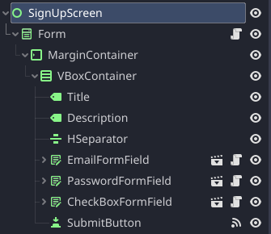
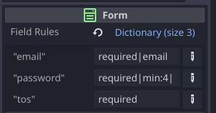

📝 Godot Forms addon for [Godot Engine](https://godotengine.org/).

---

# ❓ What is it and why?

Form management is usually quite boring for a game developer. 
With a data validation system and pre-created types you will be able to create interfaces faster and stay focused on the logic of your game.

    

# ⚙️ Installation

1. [Download for Godot 4.x](https://github.com/Donorhan/godot-forms/archive/refs/heads/godot-4.x.zip)
2. Unpack the `godot-forms` folder into your `/addons` folder within the Godot project
3. Enable this addon within the Godot settings: `Project > Project Settings > Plugins`

# 🧪 Examples

Two interfaces are available by default in the UI folder, this will allow you to see how to link the signals to the form and test different interfaces

     
    

# 📚 Getting started

## Tutorial (Godot 4.0+)

1. Add a Form node to your UI
2. Configure the Form node fields rules in the inspector
3. Add fields to the form using nodes likes "LineEditFormField" or "CheckBoxFormField"
4. Add a button to the form and connect the "pressed" signal to the "submit" function on the Form node
5. The Form node will emit a signal named "form_submitted" with a dictionary containing all fields values
6. (Optional) Duplicate the theme available in the theme folder and link it to the form

You can of course customize the theme and add new Nodes and validation rules.

##  Form

A form is responsible for the fields validation and data consistency before sending them.

##  FormField

The FormField is an overlay around the basic types of Godot, it allows to display errors or display icon in front of the fields.

It is quite possible to create its own type as long as it inherits from the UIFormField class.

# ✅ Validation Rules

A list of validation rules is present in the project, it is quite possible to create new ones and add them to the DataValidator.

Here is a list of validation rules present by default:
- "required": Indicates the field as required
- "min:x": Indicates the minimum number of characters that the field must have
- "max:x": Indicates the maximum number of characters that the field must have
- "email": Tells the form that the field must have a valid email format
- "number": The field must have an int or float value

# 🍻 Contributing to this project

In case you want to suggest improvements to this addon or fix issues, feel free to raise a pull request or [raise an issue](https://github.com/Donorhan/godot-forms/issues)!
